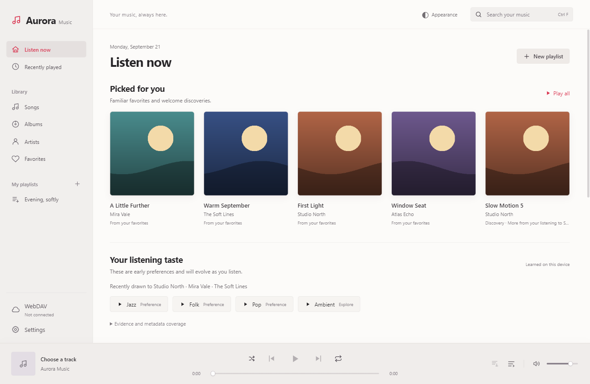

# Aurora Music Next

[简体中文](README.md) · [繁體中文](README.zh-TW.md) · [English](README.en.md) · [Français](README.fr.md)

A Windows WebDAV music player with light and dark themes, local listening preferences and optional AI playlists.

## Features

- WebDAV browsing and recursive indexing; search, albums and artists.
- Queue, favourites, recent listening, playlists, synchronised lyrics and keyboard shortcuts.
- Local FFmpeg compatibility decoding for M4A / MP4 / ALAC without modifying remote files.
- Behaviour-based recommendations and optional AI scene understanding, with full-library retrieval before candidate selection.
- DeepSeek, OpenAI-compatible, Anthropic and Gemini services with ordered fallback.
- Lyrics, artwork and background search with explicit preview and apply.
- Simplified Chinese, Traditional Chinese, English and French; persistent language selection.

## Get started

Read the [illustrated guide](docs/guides/en.md). See [CONTRIBUTING](CONTRIBUTING.md) for development and local builds.

This is a **1.4.0 source preview**. Locked dependencies have known security advisories. Upgrade and regression testing, plus complete corresponding-source materials for redistributed FFmpeg binaries, are required before a public binary release. See [SECURITY](SECURITY.md) and [third-party notices](THIRD_PARTY_NOTICES.md).

## Privacy and publishing

Screenshots contain fictional demo tracks, artists, artwork and history. The source archive excludes credentials, real libraries, caches, installers and the FFmpeg executable. Read [PRIVACY](PRIVACY.md) for network boundaries.

For GitHub, extract and upload the source archive contents, keeping the documentation image folders. Do not upload the development directory or application data. Follow the [release checklist](docs/QA_CHECKLIST.md).

Copyright © 2026 jinlaoshi. Original project code: [GPL-3.0-only](LICENSE). Third-party components retain their own licences. by jinlaoshi
