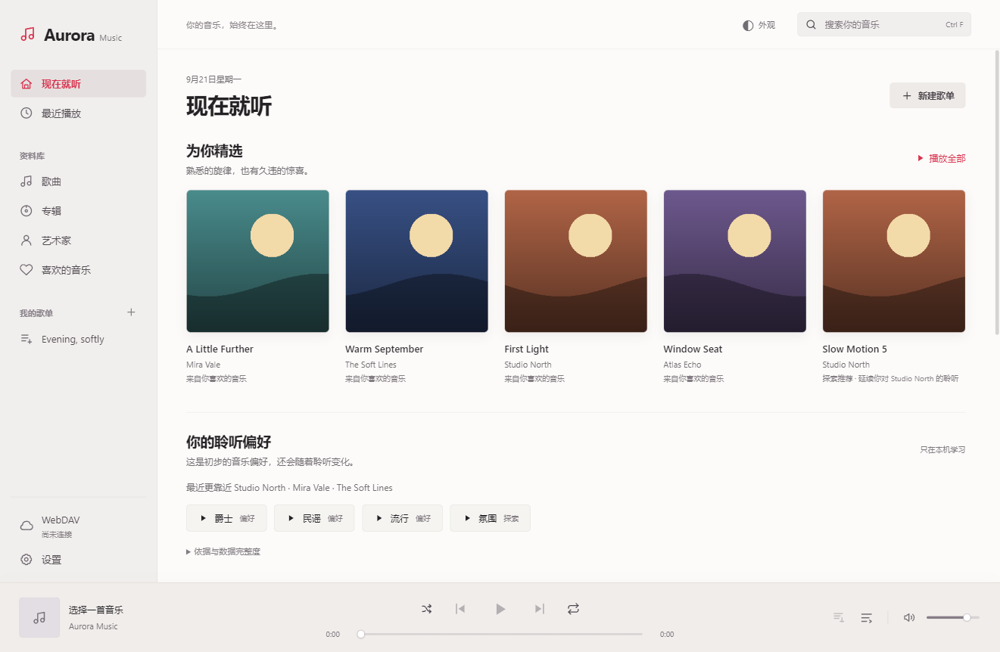

# Aurora Music Next

[简体中文](README.md) · [繁體中文](README.zh-TW.md) · [English](README.en.md) · [Français](README.fr.md)

一个面向 Windows 的 WebDAV 音乐播放器。明亮与深色主题、本地聆听偏好、可选 AI 歌单；音乐与收藏仍由你掌握。

## 功能

- WebDAV 目录浏览、递归曲库索引、搜索、专辑与艺术家视图。
- 播放队列、收藏、最近播放、普通歌单、同步歌词与键盘快捷键。
- M4A / MP4 / ALAC 本机 FFmpeg 兼容解码，不修改远端音频。
- 根据收藏、听完与跳过行为推荐；AI 可理解场景并从全曲库筛选的候选中编排歌单。
- DeepSeek / OpenAI 兼容 / Anthropic / Gemini，多服务优先级与失败回退。
- 歌词、封面和背景检索，预览后手动应用。
- 简体中文、繁體中文、English、Français，切换后自动记住。

## 开始使用

阅读[带图片的使用指南](docs/guides/zh-CN.md)。开发与本机构建见 [CONTRIBUTING](CONTRIBUTING.md)。

这是 **1.4.0 源码预览版**。当前锁定依赖仍有已知安全告警，正式二进制发布前还需升级与回归；现有 FFmpeg 二进制的对应源码分发材料也尚未齐备。详见 [SECURITY](SECURITY.md) 和 [第三方说明](THIRD_PARTY_NOTICES.md)，不要把开发构建宣传为已完成安全审计的正式版。

## 隐私与开源

演示图中的艺术家、歌曲、封面和历史均为虚构测试数据。源码包不包含账号、真实曲库、缓存、安装器或 FFmpeg 可执行文件。API 仅在你主动启用相应功能时接收必要信息；见 [PRIVACY](PRIVACY.md)。

Copyright © 2026 jinlaoshi. 项目原创代码采用 [GPL-3.0-only](LICENSE)；第三方组件遵循各自许可证。by jinlaoshi
