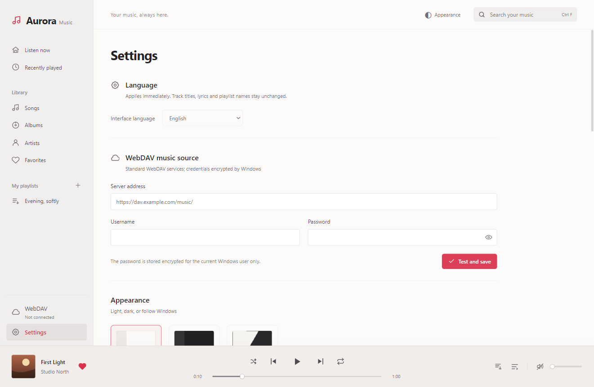
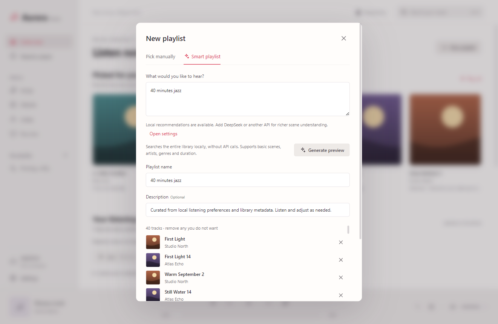
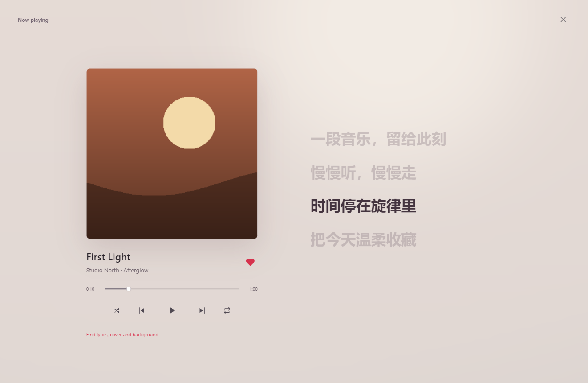

# User guide

[简体中文](zh-CN.md) · [繁體中文](zh-TW.md) · [English](en.md) · [Français](fr.md) · [Home](../../README.en.md)

For Aurora Music Next 1.4.0. All screenshots use fictional demo content, not downloadable commercial music. This is a source preview; see [release blockers](../../SECURITY.md).

## 1. Launch, language and appearance

The target is Windows x64. Other platforms and ARM64 have not been verified. Follow the [build instructions](../../CONTRIBUTING.md) for local development. When a verified installer is released, obtain it from the maintainer’s Releases and check its published hash; do not whitelist unknown software.

Open Settings at the lower left. Choose Simplified Chinese, Traditional Chinese, English or French in the first section. The choice applies immediately and persists. Track titles, lyrics and your playlist names remain unchanged. Choose light, dark or system appearance; the top bar also offers a quick toggle.

## 2. Connect WebDAV

Enter the server’s WebDAV endpoint, username and password, then choose Test and save. `https://dav.example.com/music/` is a placeholder: use your own endpoint, preferably HTTPS. Do not embed credentials in the URL.

Open WebDAV, browse to your music and synchronise the library. This builds a local index, not a complete audio download. Full-library recommendations search **all synchronised entries**, not unindexed files still on the server.

## 3. Play and organise

Search in Songs and click a track. The bottom player provides seek, volume, shuffle and repeat; the queue shows upcoming tracks. Use hearts for favourites and browse Albums, Artists or Recent listening. Create playlists and add or remove tracks. Deleting a playlist does not delete remote audio.

The first M4A / MP4 / ALAC play may download and decode into a local FLAC cache. Originals are unchanged. Damaged, DRM-protected or incorrectly served files are not guaranteed to play.

## 4. Local recommendations

The home page learns from favourites, actual listening, skips and recency. Resume does not count as a new play; seeking is not full listening. Explore preference categories and expand the evidence section.

This is an explainable weighted model, not a downloaded language model. Missing genre, artist and duration tags reduce quality. Playing some tracks can enrich metadata; an empty history is not presented as a learned taste.

## 5. Hybrid playlists

Choose New playlist → Smart playlist. Try “40 minutes jazz”; for a richer AI request, try “A 40-minute Mandarin playlist for a night run”. Local mode needs no key and handles basic artists, genres, scenes and duration. Complex meaning and language filters depend on available metadata.

To enable AI, add a service in Settings, enter its endpoint, actual model ID and your own API key, then save. Enabled services are tried from top to bottom. DeepSeek, OpenAI-compatible, Anthropic and Gemini protocols are supported; arbitrary gateways are not guaranteed compatible.

Usually one request interprets the scene and another arranges up to 240 relevant candidates retrieved from the whole library. This is not a scan limited to the first 240 tracks. Failed providers fall back in order, potentially increasing charges; local fallback remains available. Requests include your prompt, taste summary and candidate metadata, never audio, paths or raw history.

Review and edit the result before Save playlist. Previews are not automatically saved. Unknown track lengths are estimated at four minutes, and removing tracks changes the total.

## 6. Lyrics and images

Open Now playing through the bottom artwork, then choose the resource-search button. Check title, artist and album, search, preview and explicitly apply. Defaults use LRCLIB for lyrics and TheAudioDB for images. Custom endpoints are configured in Settings; see the [API contract](../API_INTEGRATION.md).

Timed lyric lines support seeking; plain text does not provide exact timing. Results may be missing or incorrect. Availability is not a copyright licence.

## 7. Cache and shortcuts

Settings controls the audio cache limit and clearing. Clearing preserves playlists, favourites and the index, but uncached playback needs a connection. Compatibility decoding has a separate 512 MB cache, cleared at the same time.

- Space: play / pause.
- Left / Right: seek backward / forward five seconds.
- Ctrl F: search.
- Esc: dismiss an overlay.

## 8. Troubleshooting and privacy

Connection errors: check endpoint, network and account access. API errors: check protocol, version root, model ID and credits; re-enter the key when changing the endpoint. Missing recommendations: synchronise again and check metadata and filters. The app never invents external tracks.

Windows encrypts credentials for the current user; it does not encrypt the entire database or media cache. Malware under the same account can still access data. Do not publish AppData, databases, logs or account screenshots. Revoke and replace exposed keys; deleting a file does not undo a leak.

by jinlaoshi · [GPL-3.0-only](../../LICENSE)
