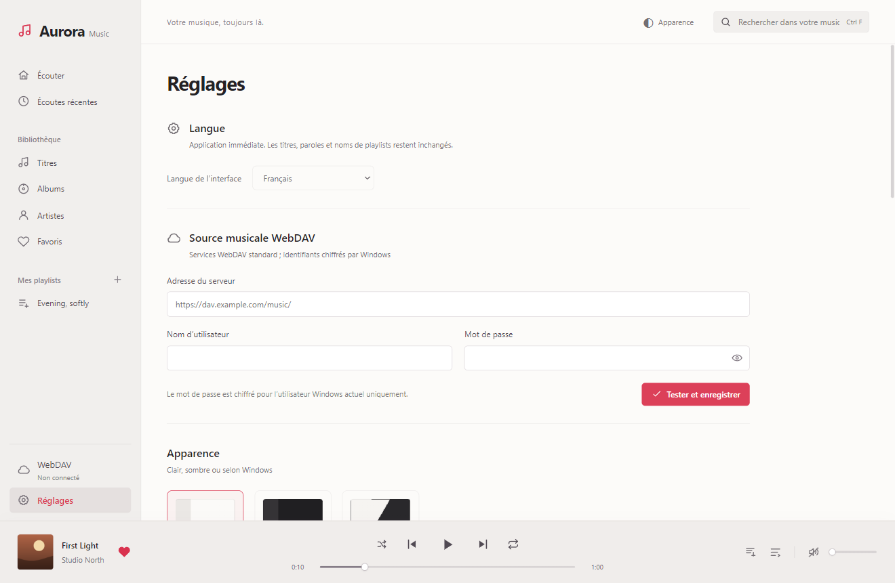
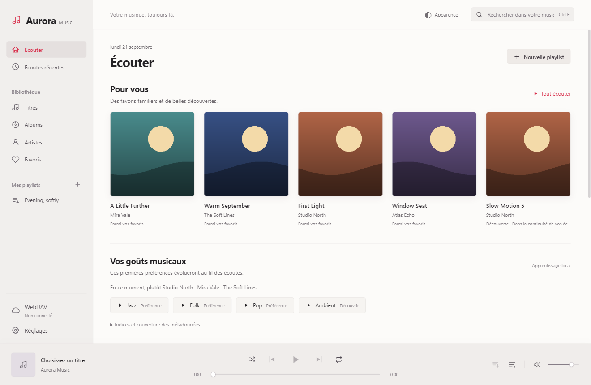
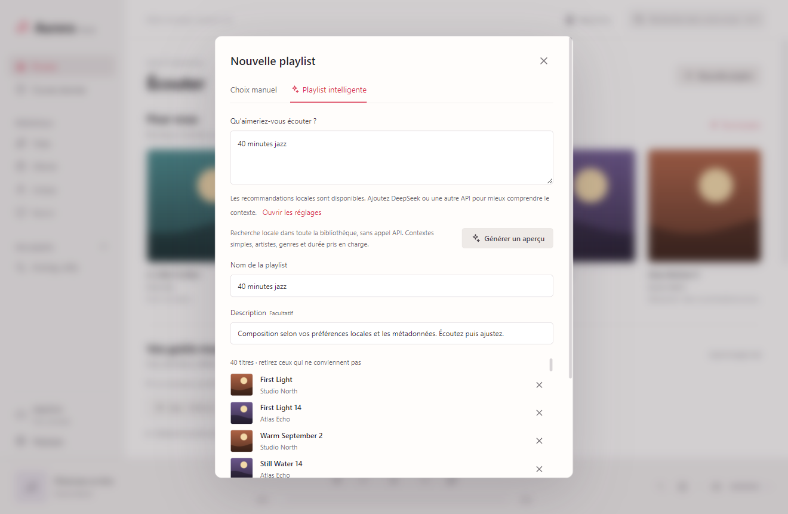
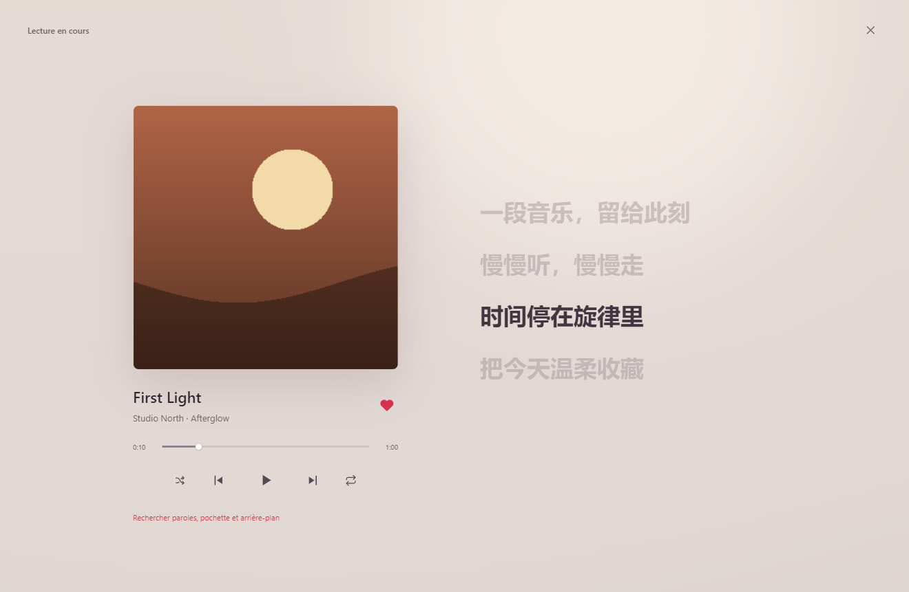

# Guide d’utilisation

[简体中文](zh-CN.md) · [繁體中文](zh-TW.md) · [English](en.md) · [Français](fr.md) · [Accueil](../../README.fr.md)

Pour Aurora Music Next 1.4.0. Les captures utilisent uniquement des données fictives et ne proposent aucun téléchargement musical. Cette version est un aperçu du code source ; voir les [points bloquants](../../SECURITY.md).

## 1. Démarrage, langue et apparence

La plateforme visée est Windows x64. Les autres plateformes et ARM64 ne sont pas validés. Pour démarrer localement, suivez les [instructions de compilation](../../CONTRIBUTING.md). Lorsqu’un installateur vérifié sera publié, utilisez les Releases du mainteneur et vérifiez son empreinte. N’autorisez pas aveuglément un programme inconnu.

Ouvrez Réglages en bas à gauche. La première section propose le chinois simplifié, le chinois traditionnel, l’anglais et le français. Le choix s’applique immédiatement et reste mémorisé ; titres, paroles et noms de playlists ne sont pas traduits. Choisissez un thème clair, sombre ou selon Windows ; un bouton en haut permet aussi de basculer.

## 2. Connexion WebDAV

Saisissez le point d’accès WebDAV, le nom d’utilisateur et le mot de passe, puis Tester et enregistrer. L’adresse `https://dav.example.com/music/` n’est qu’un exemple : utilisez votre serveur, de préférence en HTTPS, sans identifiants dans l’URL.

Ouvrez WebDAV, accédez à vos dossiers et synchronisez la bibliothèque. Cela crée un index local, sans télécharger toute la musique. La recherche globale concerne **toutes les entrées synchronisées**, pas les fichiers encore absents de cet index.

## 3. Écoute et organisation

Recherchez un morceau dans Titres, puis cliquez dessus. Le lecteur inférieur gère la position, le volume, la lecture aléatoire et la répétition ; la file affiche les prochains titres. Le cœur ajoute aux favoris. Consultez aussi Albums, Artistes et Écoutes récentes. Créez des playlists et ajoutez ou retirez des morceaux ; supprimer une playlist ne supprime pas les fichiers distants.

La première lecture M4A / MP4 / ALAC peut nécessiter un téléchargement et un décodage local en FLAC. Les originaux restent inchangés. Les fichiers endommagés, protégés par DRM ou mal servis ne sont pas garantis lisibles.

## 4. Recommandations locales

L’accueil tient compte des favoris, de l’écoute réelle, des sauts et de la récence. Reprendre après une pause n’est pas une nouvelle écoute ; déplacer le curseur ne signifie pas avoir tout écouté. Explorez les catégories de goûts et ouvrez la section des indices.

Il s’agit d’un modèle pondéré explicable, pas d’un grand modèle de langage téléchargé. Des métadonnées manquantes réduisent la précision. Lire des morceaux peut enrichir les tags ; sans historique, le lecteur ne prétend pas connaître vos goûts.

## 5. Playlists hybrides

Choisissez Nouvelle playlist → Playlist intelligente. Essayez « 40 minutes jazz » ; avec l’IA, une demande plus complexe comme « Une playlist de 40 minutes en mandarin pour courir le soir » est possible. Le mode local, sans clé, traite les artistes, genres, ambiances et durées simples ; les contraintes complexes et de langue dépendent des tags disponibles.

Pour activer l’IA, ajoutez un service dans Réglages, saisissez son adresse, l’identifiant exact du modèle et votre propre clé API, puis enregistrez. Les services activés sont essayés du haut vers le bas. DeepSeek et les protocoles OpenAI compatible, Anthropic et Gemini sont pris en charge ; une passerelle quelconque n’est pas forcément compatible.

En général, une requête interprète la demande, puis une autre organise au plus 240 candidats pertinents sélectionnés dans toute la bibliothèque. Ce n’est pas une analyse limitée aux 240 premiers titres. Les échecs entraînent un repli et peuvent augmenter le coût ; le mode local reste disponible. Seuls la demande, un résumé des goûts et les métadonnées utiles sont transmis, jamais l’audio, les chemins ou l’historique brut.

Vérifiez le résultat avant Enregistrer la playlist. Un aperçu n’est pas enregistré automatiquement. Une durée inconnue est estimée à quatre minutes ; retirer un titre change la durée totale.

## 6. Paroles, pochettes et fonds

Cliquez sur la pochette inférieure pour ouvrir En cours de lecture, puis utilisez la recherche de ressources. Vérifiez titre, artiste et album, recherchez, prévisualisez et appliquez explicitement. Les sources par défaut sont LRCLIB pour les paroles et TheAudioDB pour les images. Des services personnalisés peuvent être définis dans Réglages ; voir le [contrat API](../API_INTEGRATION.md).

Les lignes horodatées permettent de changer la position ; un texte simple n’offre pas de synchronisation précise. Les résultats peuvent manquer ou être erronés. Leur disponibilité n’accorde aucun droit d’auteur.

## 7. Cache et raccourcis

Réglages permet de limiter ou vider le cache audio. L’index, les favoris et les playlists sont conservés ; les morceaux non disponibles localement nécessitent ensuite une connexion. Le cache de décodage de 512 Mo est distinct et vidé en même temps.

- Espace : lecture / pause.
- Flèche gauche / droite : reculer / avancer de cinq secondes.
- Ctrl F : rechercher.
- Échap : fermer une fenêtre superposée.

## 8. Dépannage et confidentialité

Connexion : vérifiez adresse, réseau et autorisations. API : vérifiez protocole, racine de version, modèle et crédit ; une nouvelle adresse exige de saisir à nouveau la clé. Titres absents : resynchronisez et vérifiez tags et filtres. Le lecteur n’invente pas de morceaux extérieurs.

Windows chiffre les identifiants pour l’utilisateur courant, mais pas toute la base ni les médias. Un logiciel malveillant sous le même compte peut toujours accéder aux données. Ne publiez ni AppData, ni base, ni journaux, ni capture contenant un compte. Révoquez et remplacez toute clé exposée : effacer un fichier n’annule pas une fuite.

by jinlaoshi · [GPL-3.0-only](../../LICENSE)
