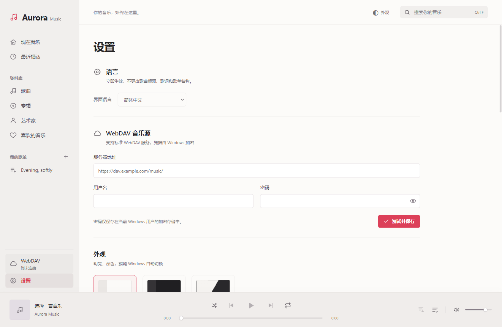
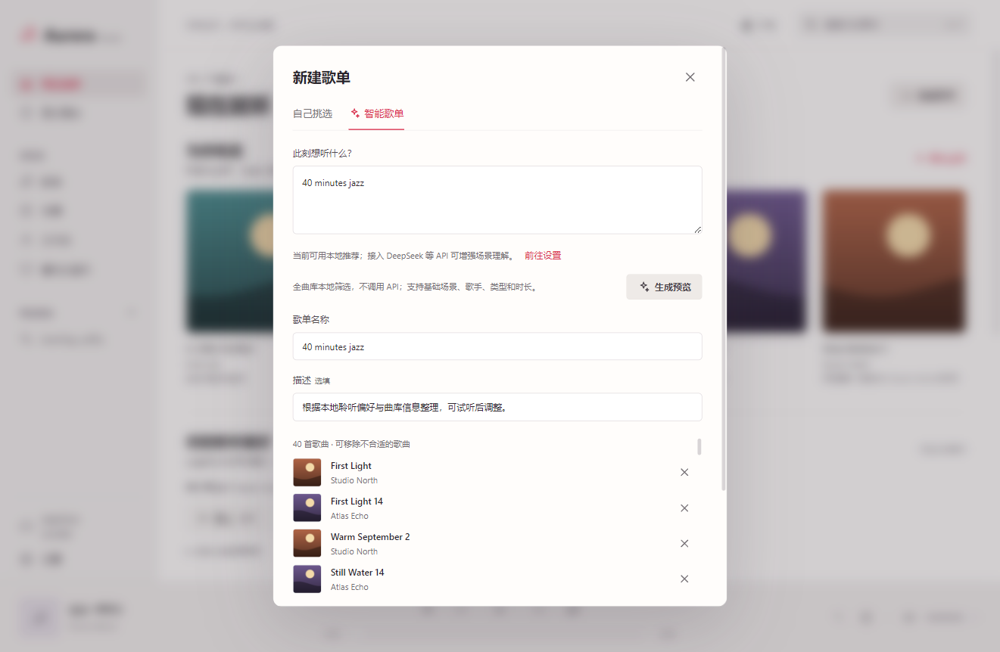
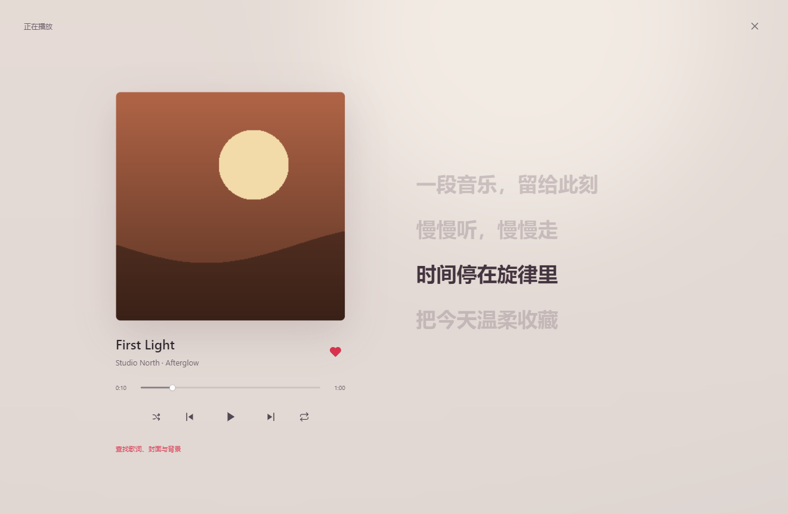

# 使用指南

[简体中文](zh-CN.md) · [繁體中文](zh-TW.md) · [English](en.md) · [Français](fr.md) · [首页](../../README.md)

本指南对应 Aurora Music Next 1.4.0。截图均来自虚构演示曲库，不提供音乐下载。当前为源码预览，正式安装包发布前的待办见 [SECURITY](../../SECURITY.md)。

## 1. 启动与语言

目标平台为 Windows x64；其他平台和 ARM64 未验收。开发者可按[构建步骤](../../CONTRIBUTING.md)启动。未来发布安装器时，应从项目维护者的 Releases 获取，并核对发布校验值；不要将未知来源程序加入系统白名单。

在左下角「设置」的首项选择简体、繁体、英文或法语，立即生效并记住选择。歌曲、歌词和自建歌单不会被翻译。外观可选明亮、深色或跟随系统，顶部也可快速切换。

## 2. 连接 WebDAV

填写服务器提供的 WebDAV 入口、用户名和密码，例如占位地址 `https://dav.example.com/music/`，点击「测试并保存」。请替换为自己的服务地址；推荐 HTTPS，不把密码写在 URL 中。

打开左侧「WebDAV」，进入音乐目录并同步曲库。同步建立本机索引，不等于下载全部音频。推荐检索的是**全部已同步索引**，不是服务器上尚未同步的文件。

## 3. 播放与管理

在「歌曲」中搜索并点击歌曲，使用底部播放器调节进度、音量、随机与循环；队列显示接下来播放的歌曲。爱心标记收藏。「专辑」「艺术家」「最近播放」提供不同入口。歌单支持创建、加入歌曲、移除歌曲及删除；删除歌单不会删除远端音频。

M4A / MP4 / ALAC 首次播放可能需要下载并转换为本机 FLAC 缓存，请等待完成。原文件不改动；DRM、损坏文件与异常服务器响应不保证可播放。

## 4. 本地推荐与个人偏好

首页根据收藏、实际听完、跳过和近期聆听更新推荐。暂停恢复不算新播放，拖进度条不等于完整听完。点击偏好类型可探索类似音乐，并展开「依据与数据完整度」查看说明。

这是可解释的加权行为模型，不是下载到电脑上的大语言模型。缺少类型、歌手或时长标签会降低准确度；先播放一些歌曲可读取更多元数据。没有历史时不会假称了解你的喜好。

## 5. 本地与 AI 混合歌单

「新建歌单 → 智能歌单」输入需求，例如「40 分钟爵士」或「生成 40 分钟适合夜跑的华语歌单」。本地模式无需密钥，支持基础歌手、类型、场景和时长；复杂语义和语种筛选依赖可用标签，无法保证每次都有匹配。

需要 AI 时，在设置添加服务、填写地址、模型 ID 和自己的 API Key，保存后按从上到下的优先级使用。支持 DeepSeek、OpenAI 兼容、Anthropic 与 Gemini；接入兼容协议不保证任意中转站都能使用。

通常先解析场景，再在全库检索后向 AI 提交最多 240 首相关候选；不是只检测曲库前 240 首。失败会尝试下一服务或回退本地，多次尝试可能增加费用。只发送需求、偏好摘要和必要候选信息，不上传音频、路径及原始历史。

生成后检查名称、歌曲和时长，再点「保存歌单」。预览不会自动保存；未知时长按每首 4 分钟估计，移除歌曲会改变总时长。

## 6. 歌词、封面与背景

点击底部封面打开「正在播放与歌词」，选择资源查找按钮，核对歌名、歌手与专辑，搜索后预览，再手动应用。默认歌词来源为 LRCLIB，图片来源为 TheAudioDB；设置中可接自己的资源 API，见[接口说明](../API_INTEGRATION.md)。

时间轴歌词可点击跳转；纯文本歌词不支持精确同步。第三方内容可能缺失或匹配错误，应用不会保证覆盖率或替你取得版权许可。

## 7. 缓存与快捷键

设置可调整音频缓存上限并清空缓存。清空不会删除曲库、收藏或歌单；下次播放未缓存内容需要联网。兼容解码另有 512 MB 缓存，也会一起清理。

- Space：播放 / 暂停。
- ← / →：快退 / 快进 5 秒。
- Ctrl F：搜索。
- Esc：关闭浮层。

## 8. 常见问题与隐私

连接失败：检查 WebDAV 入口、网络和账号权限。API 失败：核对模型 ID、额度、协议与版本根地址；更换服务地址后要重填密钥。推荐缺歌：重新同步，检查标签及筛选条件；曲库不足时不会凭空添加外部歌曲。

凭据使用当前 Windows 用户加密，数据库、曲库和图片缓存并非整体加密；同一账号下的恶意软件仍可能访问。不要公开 AppData、数据库、日志和含账号的截图。如果密钥曾公开，先撤销并重新生成，删除本地文本不能撤回泄露。

by jinlaoshi · [GPL-3.0-only](../../LICENSE)
