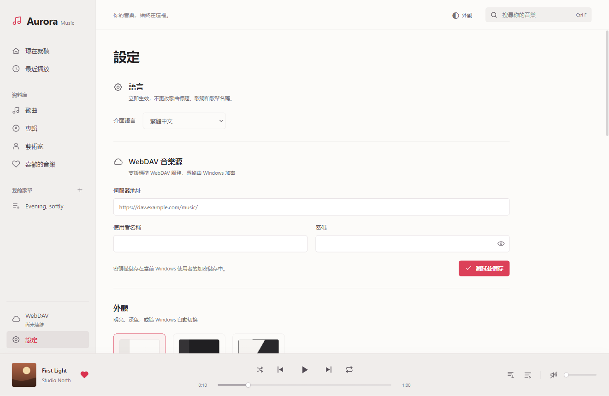
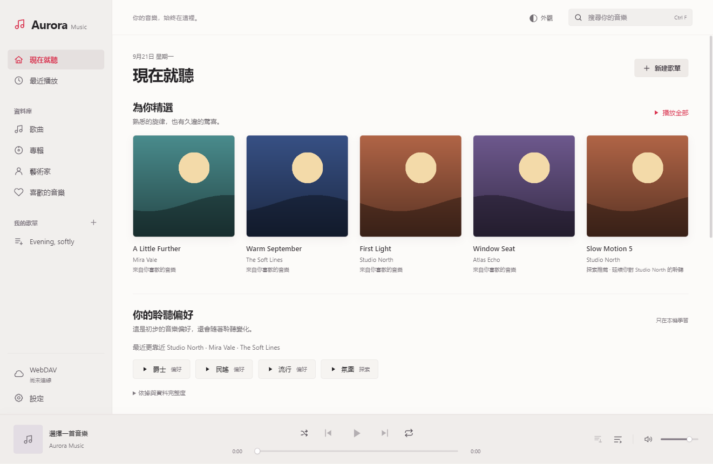
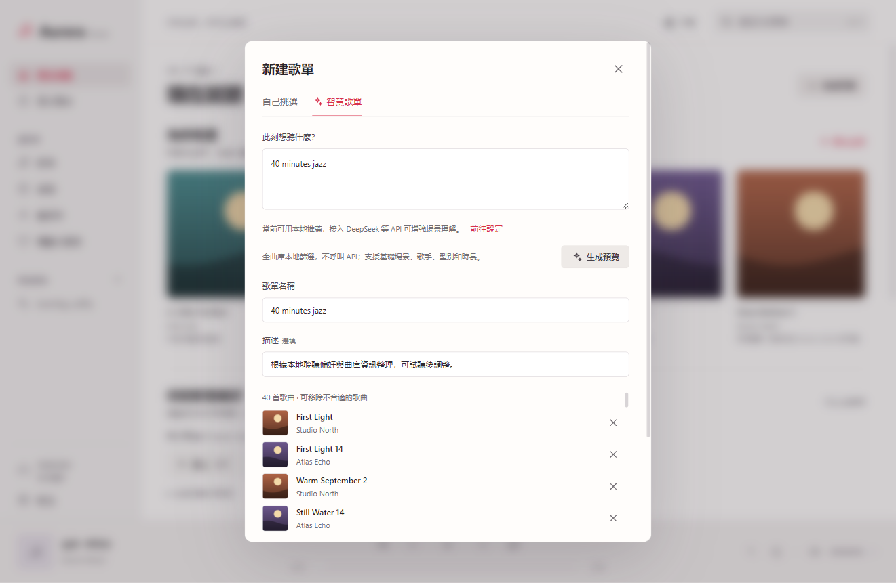
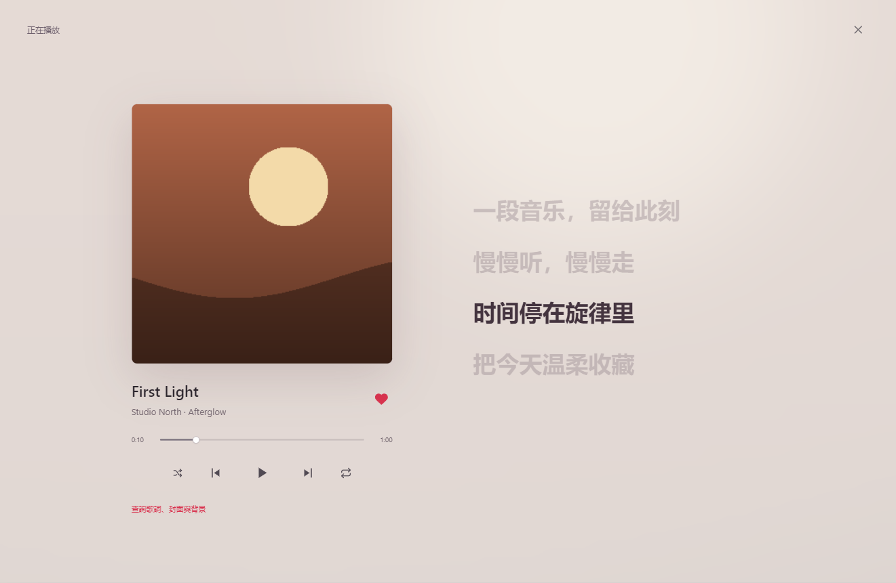

# 使用指南

[簡體中文](zh-CN.md) · [繁體中文](zh-TW.md) · [English](en.md) · [Français](fr.md) · [首頁](../../README.zh-TW.md)

本指南對應 Aurora Music Next 1.4.0。截圖均來自虛構演示曲庫，不提供音樂下載。當前為原始碼預覽，正式安裝包釋出前的待辦見 [SECURITY](../../SECURITY.md)。

## 1. 啟動與語言

目標平臺為 Windows x64；其他平臺和 ARM64 未驗收。開發者可按[構建步驟](../../CONTRIBUTING.md)啟動。未來發布安裝器時，應從專案維護者的 Releases 獲取，並核對釋出校驗值；不要將未知來源程式加入系統白名單。

在左下角「設定」的首項選擇簡體、繁體、英文或法語，立即生效並記住選擇。歌曲、歌詞和自建歌單不會被翻譯。外觀可選明亮、深色或跟隨系統，頂部也可快速切換。

## 2. 連線 WebDAV

填寫伺服器提供的 WebDAV 入口、使用者名稱和密碼，例如佔位地址 `https://dav.example.com/music/`，點選「測試並儲存」。請替換為自己的服務地址；推薦 HTTPS，不把密碼寫在 URL 中。

開啟左側「WebDAV」，進入音樂目錄並同步曲庫。同步建立本機索引，不等於下載全部音訊。推薦檢索的是**全部已同步索引**，不是伺服器上尚未同步的檔案。

## 3. 播放與管理

在「歌曲」中搜索並點選歌曲，使用底部播放器調節進度、音量、隨機與迴圈；佇列顯示接下來播放的歌曲。愛心標記收藏。「專輯」「藝術家」「最近播放」提供不同入口。歌單支援建立、加入歌曲、移除歌曲及刪除；刪除歌單不會刪除遠端音訊。

M4A / MP4 / ALAC 首次播放可能需要下載並轉換為本機 FLAC 快取，請等待完成。原檔案不改動；DRM、損壞檔案與異常伺服器響應不保證可播放。

## 4. 本地推薦與個人偏好

首頁根據收藏、實際聽完、跳過和近期聆聽更新推薦。暫停恢復不算新播放，拖進度條不等於完整聽完。點選偏好型別可探索類似音樂，並展開「依據與資料完整度」檢視說明。

這是可解釋的加權行為模型，不是下載到電腦上的大語言模型。缺少型別、歌手或時長標籤會降低準確度；先播放一些歌曲可讀取更多後設資料。沒有歷史時不會假稱瞭解你的喜好。

## 5. 本地與 AI 混合歌單

「新建歌單 → 智慧歌單」輸入需求，例如「40 分鐘爵士」或「生成 40 分鐘適合夜跑的華語歌單」。本地模式無需金鑰，支援基礎歌手、型別、場景和時長；複雜語義和語種篩選依賴可用標籤，無法保證每次都有匹配。

需要 AI 時，在設定新增服務、填寫地址、模型 ID 和自己的 API Key，儲存後按從上到下的優先順序使用。支援 DeepSeek、OpenAI 相容、Anthropic 與 Gemini；接入相容協議不保證任意中轉站都能使用。

通常先解析場景，再在全庫檢索後向 AI 提交最多 240 首相關候選；不是隻檢測曲庫前 240 首。失敗會嘗試下一服務或回退本地，多次嘗試可能增加費用。只發送需求、偏好摘要和必要候選資訊，不上傳音訊、路徑及原始歷史。

生成後檢查名稱、歌曲和時長，再點「儲存歌單」。預覽不會自動儲存；未知時長按每首 4 分鐘估計，移除歌曲會改變總時長。

## 6. 歌詞、封面與背景

點選底部封面開啟「正在播放與歌詞」，選擇資源查詢按鈕，核對歌名、歌手與專輯，搜尋後預覽，再手動應用。預設歌詞來源為 LRCLIB，圖片來源為 TheAudioDB；設定中可接自己的資源 API，見[介面說明](../API_INTEGRATION.md)。

時間軸歌詞可點選跳轉；純文本歌詞不支援精確同步。第三方內容可能缺失或匹配錯誤，應用不會保證覆蓋率或替你取得版權許可。

## 7. 快取與快捷鍵

設定可調整音訊快取上限並清空快取。清空不會刪除曲庫、收藏或歌單；下次播放未快取內容需要聯網。相容解碼另有 512 MB 快取，也會一起清理。

- Space：播放 / 暫停。
- ← / →：快退 / 快進 5 秒。
- Ctrl F：搜尋。
- Esc：關閉浮層。

## 8. 常見問題與隱私

連線失敗：檢查 WebDAV 入口、網路和賬號許可權。API 失敗：核對模型 ID、額度、協議與版本根地址；更換服務地址後要重填金鑰。推薦缺歌：重新同步，檢查標籤及篩選條件；曲庫不足時不會憑空新增外部歌曲。

憑據使用當前 Windows 使用者加密，資料庫、曲庫和圖片快取並非整體加密；同一賬號下的惡意軟體仍可能訪問。不要公開 AppData、資料庫、日誌和含賬號的截圖。如果金鑰曾公開，先撤銷並重新生成，刪除本地文本不能撤回洩露。

by jinlaoshi · [GPL-3.0-only](../../LICENSE)
